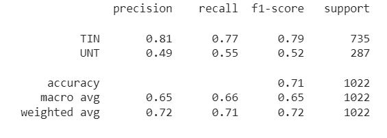

## OffenseEval2020-Multilingual-offensive-Language-Identification-in-Social-Media

Our project revolves around SemEval-2020 Task 12 on Multilingual Offensive Language Identification in Social Media (OffensEval-2020). We tackle the challenge of detecting and categorizing offensive language in social media posts using annotated datasets such as OLID/SOLID. Leveraging machine learning algorithms like Support Vector Machine (SVM) and deep learning techniques like Long Short-Term Memory (LSTM), BERT networks, we aim to develop models capable of accurately identifying offensive language, categorizing it based on its nature and target, and providing insights into the dynamics of online interactions.

In this project, we focus on addressing three key subtasks related to offensive language detection in social media. The first subtask involves identifying offensive language in tweets, aiming to classify them as either offensive or not. The second subtask extends this by categorizing offensive language into different types, while the third subtask delves into identifying the specific target of offensive language. Leveraging machine learning techniques and deep learning architectures, we develop models tailored to each subtask's requirements, striving to enhance our understanding of offensive language detection and contribute to the development of more effective moderation systems for online content.
## Subtasks Overview

## Subtask A

Subtask A focuses on the detection of offensive language in tweets, categorizing them as either offensive or not. To achieve this, Long Short-Term Memory (LSTM) networks are employed with oversampled training data to construct the model. The model architecture involves layers for processing sequences of integers, embedding them into dense vectors, and capturing sequential dependencies using LSTM units. Global max pooling condenses information from the sequences, followed by dense layers for classification. The model demonstrates promising performance, with enhanced recall and F1-score compared to a baseline Bag-of-Words model. Evaluation on both OLID and SOLID datasets showcases the effectiveness of the LSTM model in accurately identifying offensive language in tweets. The code provided includes data preprocessing steps, model training, evaluation, and testing on various datasets, demonstrating the practical implementation of the LSTM approach for subtask A.

## SubTask B

Subtask B focuses on the classification of offensive language into Targeted Insult and Threat (TIN) and Un-targeted Insult and Threat (UNT) categories, leveraging BERT (Bidirectional Encoder Representations from Transformers). The process encompasses several key stages, with a focus on fine-tuning the BERT model for optimal performance.The process begins with data loading and pre-processing, where datasets such as 'labels-levelb.csv', 'testset-levelb.tsv', and 'olid-training-v1.0.tsv' are loaded. Pre-processing steps involve removing hashtags, mentions, and numerical values, as well as tokenization. Model implementation involves configuring a BERT model for binary classification, with PyTorch utilized for architecture definition. A significant aspect of the implementation is the fine-tuning of the BERT model, which allows it to adapt to the specific task of offensive language classification. Training is conducted on the 'olid-training-v1.0.tsv' dataset, with tokenization, encoding, attention masks, and padding applied for input consistency. To address data imbalance, class weights are computed, and the AdamW optimizer is employed, demonstrating the impact of optimized parameter tuning on model performance. Evaluation metrics include accuracy, classification report, confusion matrix.

## SubTask C

Subtask C focuses on offense target identification, categorizing offensive posts based on their target into three distinct categories: Individual (IND), Group (GRP), and Other (OTH). The objective is to develop a model capable of accurately identifying the target of offensive language in online posts, facilitating the understanding of the context and intent behind such language. The implemented approach involves several key steps, including data loading, preprocessing, feature engineering using TF-IDF vectorization, model training using a Support Vector Machine (SVM) with a linear kernel, and performance evaluation using metrics such as accuracy, classification report, and confusion matrix. Additionally, techniques such as text preprocessing (removing mentions, hashtags, emojis, punctuation), TF-IDF vectorization, and SVM modeling are employed to enhance the model's predictive capabilities. The impact of these methods lies in their ability to effectively process and analyze textual data, enabling the model to discern patterns and classify offensive language based on its target, thereby contributing to the broader goal of mitigating online harassment and promoting a safer online environment.

## Datasets

OLID (Offensive Language Identification Dataset) Training Set (olid-training-v1.0.tsv):

The OLID dataset comprises 13,240 English tweets annotated using a hierarchical three-level annotation schema. This dataset includes tweets annotated for offensive language and categorized into three levels: A, B, and C. Level A identifies whether a tweet is offensive ('OFF') or not ('NOT'). Level B categorizes offensive tweets as targeting individuals ('TIN') or not ('UNT'). Level C focuses on identifying the target of offensive language, classifying it as Individual ('IND'), Group ('GRP'), or Other ('OTH').

Annotations in this dataset serve as the classes for constructing models for each subtask (A, B, and C) of offensive language identification.

Link : https://sites.google.com/site/offensevalsharedtask/olid?authuser=0

Test Sets from OLID:

Subtask A Test Set: Comprised of testset-levela.tsv and labels-levela.csv, containing 860 tweets labeled as 'OFF' or 'NOT'.

Subtask B Test Set: Consists of testset-levelb.tsv and labels-levelb.csv, including 240 tweets labeled as 'TIN' or 'UNT'.

Subtask C Test Set: Includes testset-levelc.tsv and labels-levelc.csv, containing 213 tweets labeled as 'OTH', 'GRP', or ‘IND’. These tweets are utilized to evaluate models for identifying the target of offensive language.

Test Sets from SOLID (Semi-Supervised Offensive Language Identification Dataset):

Level A Test Sets:
test_a_tweets.tsv and test_a_labels.csv: 3,887 tweets labeled for subtask A.
test_a_tweets_all.tsv with test_a_labels_easy.csv and test_a_labels_hard.csv: An extended set of 5,995 tweets for subtask A.

Level B Test Sets:
test_b_tweets.tsv and test_b_labels.csv: 1,422 tweets labeled for subtask B.
test_b_tweets_all.tsv with test_b_labels_easy.csv and test_b_labels_hard.csv: An extended set of 3,003 tweets for subtask B.

Level C Test Sets:
test_c_tweets.tsv and test_c_labels.csv: 850 tweets labeled for subtask C.
test_c_tweets_all.tsv with test_c_labels_easy.csv and test_c_labels_hard.csv: An extended set of 1,547 tweets for subtask C.

These test sets from SOLID are utilized to evaluate the performance of models developed using the OLID dataset and to assess their generalization capabilities on a larger and more diverse dataset.

Link : https://sites.google.com/site/offensevalsharedtask/solid?authuser=0
## Results and Evaluation 

SubTask A:

The LSTM model implemented for subtask A demonstrates varying levels of performance across different test datasets. In the OLID Test Set A, the model shows moderate performance, while it exhibits robust performance in the SOLID Test Set A. Particularly noteworthy is the model's exceptional performance in the SOLID Extended Easy subset, where it achieves outstanding precision, recall, and F1-Score. Despite encountering more challenging instances in the SOLID Extended Hard subset, the model maintains good performance levels. These findings highlight the effectiveness and adaptability of the LSTM model in identifying offensive language across diverse datasets.

<table>
  <tr>
    <td>
      
    </td>
  </tr>
</table>

SubTask B:

Subtask B, aimed at categorizing offensive language into Targeted Insults and Threats (TIN) and Untargeted (UNT) profanity, showcased exceptional performance on the OLID dataset, with high precision and recall values indicating the model's accuracy in identifying offensive content. The robust F1-scores for both TIN and UNT classes underscored the model's balance between precision and recall, contributing to its overall effectiveness in classifying offensive language. The model's satisfactory accuracy on the OLID dataset, coupled with comparable results on the SOLID dataset, highlights its robustness and generalizability across diverse datasets, emphasizing its utility in creating safer online environments by accurately categorizing offensive language.

<table>
  <tr>
    <td>
      
    </td>
  </tr>
</table>

SubTask C:

Upon implementing the Support Vector Machine (SVM) algorithm for subtask C, the model exhibited promising performance across multiple datasets. When evaluated on the OLID dataset, the SVM model achieved satisfactory accuracy. A confusion matrix provided insights into the model's performance across different categories, while a classification report highlighted its precision, recall, and F1-score for each category, indicating the model's ability to correctly classify offensive targets. Additionally, word clouds were generated to illustrate the frequency of words associated with each category in the OLID dataset. Furthermore, the model's performance was assessed on the SOLID dataset, where it demonstrated improved accuracy. Sampling predictions from the SOLID data showcased instances of accurate predictions and misclassifications. Overall, the SVM model showed effectiveness in identifying offensive targets across diverse datasets, as evidenced by its performance metrics.

<table>
  <tr>
    <td>
      
    </td>
  </tr>
</table>

## Conclusion

The OffensEval 2020 project represents a significant step in addressing offensive language online. While models like LSTM and BERT show promise, challenges remain in handling complex instances of offensive content. Future efforts will focus on multilingual expansion, fine-tuning models, dynamic learning, user feedback integration, cross-platform integration, and ensemble approaches to foster safer online environments.